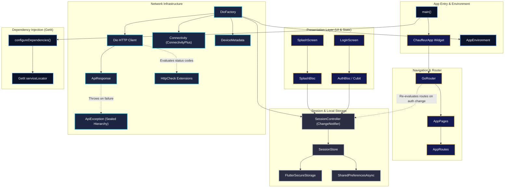
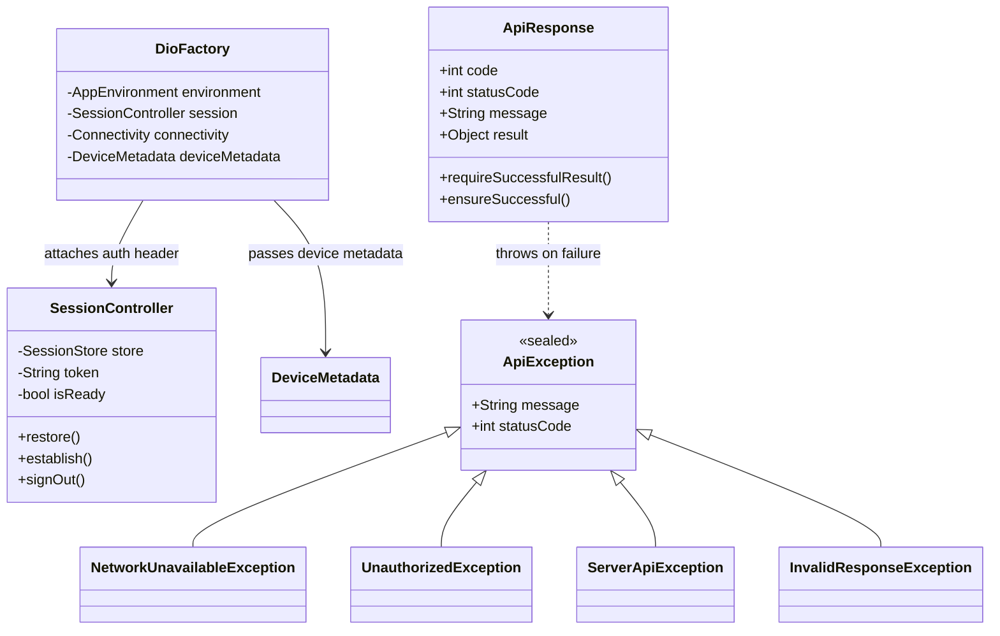

# Chauffeur Hub

**Chauffeur Hub** is a premium, high-end mobile application built with Flutter for elite chauffeur services. It delivers a seamless, secure, and sophisticated experience for drivers and clients, featuring robust session management, clean architecture, typed API error handling, and responsive luxury UI design.

---

## ✨ Key Features

- **Luxury Splash Screen & Branding**: Animated entrance with a custom glowing emblem, gradient theme (`#0B132B` to `#1C2541`), and gold accents (`#D4AF37`).
- **Secure Authentication & Session Management**: Powered by `SessionController`, `SessionStore`, and encrypted local storage (`flutter_secure_storage`). Auto-redirects via `GoRouter` auth guards.
- **Declarative Type-Safe Routing**: Route management with `GoRouter` (`AppRouter`, `AppRoutes`, `AppPages`) supporting compiled route parameter builders.
- **Robust Network Layer**:
  - `DioFactory` configured with `AppEnvironment`, `SessionController`, `Connectivity`, and `DeviceMetadata`.
  - Generic `ApiResponse<T>` wrapper with automatic JSON decoding and data validation.
  - Sealed class exception hierarchy (`ApiException`, `NetworkUnavailableException`, `UnauthorizedException`, `ServerApiException`, etc.).
  - `HttpCheck` & `NullableHttpCheck` extensions on `int` / `int?` for expressive status code checking and human-readable error messages.
- **Responsive & Adaptive Layouts**: Fluid design scaling across mobile and tablet form factors via `flutter_screenutil` and `DeviceMetadata`.

---

## 📁 Project Structure & File Map

```text
lib/
├── app/
│   ├── config/
│   │   ├── app_environment.dart        # Environment configuration & defines
│   │   └── app_flavor.dart             # Build flavor enum & settings
│   └── ChauffeurApp.dart               # Root MaterialApp.router widget with ScreenUtil
├── core/
│   ├── constants/
│   │   └── app_settings_constants.dart  # App constants & key-value settings
│   ├── services/
│   │   ├── di/
│   │   │   ├── core/
│   │   │   │   └── core_injection.dart  # DI module for core dependencies
│   │   │   ├── navigation/
│   │   │   │   └── navigation_injection.dart # DI module for GoRouter
│   │   │   ├── repo/
│   │   │   │   └── repo_injection.dart  # DI module for repositories
│   │   │   └── service_locator.dart    # Main GetIt configuration & initialization
│   │   ├── navigation/
│   │   │   ├── app_pages.dart          # GoRoute definitions & path bindings
│   │   │   ├── app_router.dart         # GoRouter instance & session guard logic
│   │   │   └── app_routes.dart         # Type-safe route string constants & builders
│   │   └── network/
│   │       ├── base/
│   │       │   ├── api_exception.dart  # Sealed ApiException hierarchy
│   │       │   ├── api_response.dart   # Generic ApiResponse<T> wrapper
│   │       │   ├── device_metadata.dart# Platform metadata & shortestSide calculation
│   │       │   └── error_message.dart  # Readable error message handler
│   │       ├── dio_factory.dart        # Dio HTTP client factory & interceptors
│   │       └── network_injection.dart  # DI module for Dio & network dependencies
│   ├── storage/
│   │   ├── session_controller.dart     # Reactive auth state manager (ChangeNotifier)
│   │   └── session_store.dart          # Encrypted & local preference session storage
│   └── utils/
│       └── extentions/
│           └── http_check.dart         # HttpCheck & NullableHttpCheck status extensions
├── features/
│   ├── auth/
│   │   └── presentation/
│   │       └── screens/
│   │           └── login/
│   │               └── login.screen.dart # Chauffeur login screen UI
│   └── splash/
│       ├── data/
│       │   └── models/
│       │       ├── app_info.dart       # App info data model
│       │       ├── app_settings.dart   # App settings model
│       │       └── setting_item.dart   # Setting item model
│       └── presentation/
│           ├── bloc/
│           │   ├── splash_bloc.dart    # Splash screen state management BLoC
│           │   ├── splash_event.dart   # Splash BLoC events
│           │   └── splash_state.dart   # Splash BLoC states
│           └── screens/
│               └── splash_screen.dart  # Animated splash screen UI
└── main.dart                           # App entrypoint & SystemChrome initialization
```

---

## 🏗️ System Architecture Diagrams

### 1. High-Level Architecture & Flow



---

### 2. Core Network & Exception Class Diagram



---

## 🛠️ Tech Stack & Architecture

- **Framework**: Flutter (`^3.13.2`) / Dart
- **Architecture**: Feature-First Clean Architecture
- **Dependency Injection**: `get_it` (`^9.2.1`)
- **State Management**: `flutter_bloc` (`^9.1.1`) / `ChangeNotifier` (`SessionController`)
- **Routing**: `go_router` (`^18.0.1`)
- **HTTP Client & Debugging**: `dio` (`^5.11.1`), `pretty_dio_logger`, `webase_chucker`
- **Network Monitoring**: `connectivity_plus` (`^7.3.1`)
- **Storage**: `flutter_secure_storage` (`^11.0.0`) & `shared_preferences` (`^2.5.5`)
- **Device & Package Info**: `package_info_plus` & `device_info_plus`

---

## 🌐 Network & Error Handling Architecture

### Generic API Response (`ApiResponse<T>`)
Every network request maps into a type-safe `ApiResponse<T>`:
```dart
final apiResponse = ApiResponse<UserModel>.fromJson(
  jsonMap,
  (json) => UserModel.fromJson(json as Map<String, dynamic>),
);

// Throws ServerApiException or InvalidResponseException if request failed or payload is missing
final user = apiResponse.requireSuccessfulResult();
```

### Sealed Exception Hierarchy (`ApiException`)
```text
ApiException (sealed)
├── NetworkUnavailableException (No internet connection)
├── RequestTimeoutException     (Connection timeout)
├── UnauthorizedException        (HTTP 401 - Session expired)
├── ServerApiException          (HTTP 5xx / 4xx error with status code)
└── InvalidResponseException    (Malformed response payload)
```

### Expressive HTTP Status Extensions (`HttpCheck`)
```dart
if (statusCode.isOk) { ... }
if (statusCode.isUnauthorized) { ... }
print(statusCode.errorMessage); // Human-readable error message
```

---

## 🚀 Getting Started

### Prerequisites

Ensure you have the following installed:
- [Flutter SDK](https://docs.flutter.dev/get-started/install) (`^3.13.2`)
- Dart SDK
- Android Studio / Xcode (for iOS and Android emulators/devices)

### Installation

1. **Clone the repository**:
   ```bash
   git clone https://github.com/your-username/chauffeur_hub.git
   cd chauffeur_hub
   ```

2. **Install dependencies**:
   ```bash
   flutter pub get
   ```

3. **Run the application**:
   ```bash
   flutter run
   ```

---

## 📄 License

This project is private and proprietary to Chauffeur Hub.
