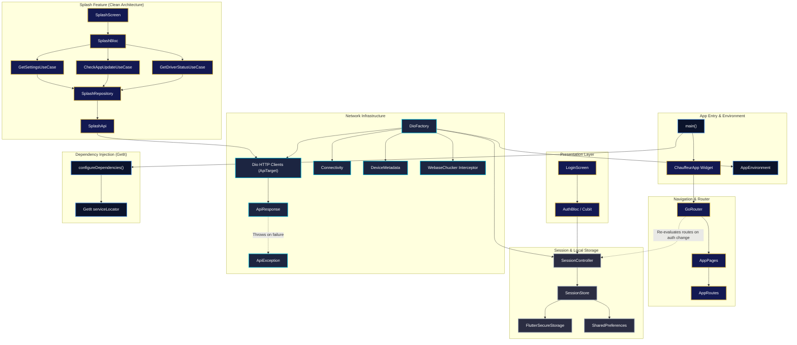
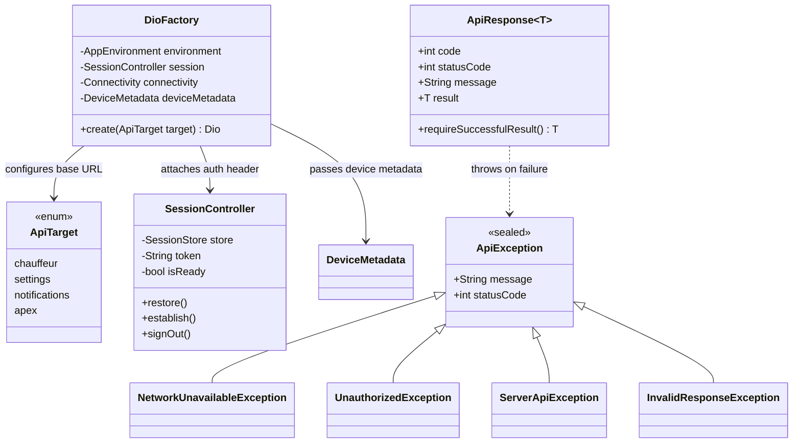

# Chauffeur Hub

**Chauffeur Hub** is a premium, high-end mobile application built with Flutter for elite chauffeur services. It delivers a seamless, secure, and sophisticated experience for drivers and clients, featuring robust session management, feature-first clean architecture, typed API error handling, and responsive luxury UI design.

---

## ✨ Key Features

- **Luxury Splash Screen & Branding**: Animated entrance with custom emblem, gradient theme (`#0B132B` to `#1C2541`), gold accents (`#D4AF37`), and automated BLoC initialization flow.
- **Secure Authentication & Session Management**: Powered by `SessionController`, `SessionStore`, and encrypted local storage (`flutter_secure_storage`). Auto-redirects via `GoRouter` auth guards.
- **Declarative Type-Safe Routing**: Route management with `GoRouter` (`AppRouter`, `AppRoutes`, `AppPages`) supporting compile-time typed parameters.
- **Multi-Target Network Infrastructure**:
  - `DioFactory` configured with `AppEnvironment`, `SessionController`, `Connectivity`, and `DeviceMetadata`.
  - Multi-service target registration using type-safe `ApiTarget` enums (`chauffeur`, `settings`, `notifications`, `apex`).
  - Integrated `webase_chucker` for in-app HTTP inspection across both Android and iOS without extra permission requirements.
  - Generic `ApiResponse<T>` wrapper with automatic JSON decoding and data validation.
  - Sealed class exception hierarchy (`ApiException`, `NetworkUnavailableException`, `UnauthorizedException`, `ServerApiException`, etc.).
  - `HttpCheck` & `NullableHttpCheck` extensions on `int` / `int?` for status code checking.
- **Clean Architecture & Pure Models**: Granular, decoupled domain models (`AppSettings`, `SettingItem`, `AppInfo`, `AppUpdateType`) leveraging `Equatable` for value equality without code generation overhead.
- **Responsive & Adaptive Layouts**: Fluid design scaling across mobile and tablet form factors via `flutter_screenutil` and `DeviceMetadata`.

---

## 📁 Project Structure & File Map

```text
lib/
├── app/
│   ├── config/
│   │   ├── app_environment.dart        # Environment configuration & defines
│   │   └── app_flavor.dart             # Build flavor enum & settings
│   └── ChauffeurApp.dart               # Root MaterialApp.router widget with ScreenUtil
├── core/
│   ├── constants/
│   │   └── app_settings_constants.dart  # App constants & key-value settings
│   ├── services/
│   │   ├── di/
│   │   │   ├── core/
│   │   │   │   └── core_injection.dart  # Core dependencies (SharedPreferences, DeviceMetadata, etc.)
│   │   │   ├── navigation/
│   │   │   │   └── navigation_injection.dart # GoRouter DI registration
│   │   │   ├── network/
│   │   │   │   └── network_injection.dart   # Multi-target Dio registration (ApiTarget enum)
│   │   │   ├── repo/
│   │   │   │   └── repo_injection.dart  # Repository DI registration
│   │   │   └── service_locator.dart    # Main GetIt configuration & initialization
│   │   ├── navigation/
│   │   │   ├── app_pages.dart          # GoRoute definitions & path bindings
│   │   │   ├── app_router.dart         # GoRouter instance & session guard logic
│   │   │   └── app_routes.dart         # Type-safe route string constants & builders
│   │   └── network/
│   │       ├── base/
│   │       │   ├── api_exception.dart  # Sealed ApiException hierarchy
│   │       │   ├── api_response.dart   # Generic ApiResponse<T> wrapper
│   │       │   ├── device_metadata.dart# Platform metadata & shortestSide calculation
│   │       │   └── error_message.dart  # Human-readable error message mapper
│   │       ├── interceptor/
│   │       │   ├── connection_interceptor.dart     # Pre-request connectivity guard
│   │       │   ├── error_interceptor.dart          # Centralized error interceptor
│   │       │   ├── request_metadat_aInterceptor.dart # Device headers interceptor
│   │       │   └── safe_log_Interceptor.dart      # Safe HTTP logger
│   │       ├── dio_factory.dart        # Dio HTTP client factory & interceptors
│   │   └── shared/
│   │       ├── data/
│   │       │   ├── dto/
│   │       │   │   ├── driver_status_dto.dart
│   │       │   │   └── location_point_dto.dart
│   │       │   └── mappers/
│   │       │       ├── driver_status_mapper.dart
│   │       │       └── location_point_mapper.dart
│   │       └── domain/
│   │           ├── models/
│   │           │   ├── driver_status.dart
│   │           │   ├── location_point.dart
│   │           │   └── trip_status.dart
│   │           └── shared_models.dart  # Shared models barrel file
│   ├── storage/
│   │   ├── session_controller.dart     # Reactive auth state manager (ChangeNotifier)
│   │   └── session_store.dart          # Encrypted & local preference session storage
│   └── utils/
│       └── extentions/
│           └── http_check.dart         # HttpCheck & NullableHttpCheck status extensions
├── features/
│   ├── auth/
│   │   └── presentation/
│   │       └── screens/
│   │           └── login/
│   │               └── login.screen.dart # Chauffeur login screen UI
│   └── splash/
│       ├── data/
│       │   ├── api/
│       │   │   └── splash_api.dart      # Splash Remote API client
│       │   ├── dto/
│       │   │   ├── app_settings_dto.dart
│       │   │   └── setting_item_dto.dart
│       │   ├── mapper/
│       │   │   ├── app_settings_mapper.dart
│       │   │   └── setting_item_mapper.dart
│       │   └── repo/
│       │       └── splash_repository_impl.dart # Splash repository implementation
│       ├── domain/
│       │   ├── models/
│       │   │   ├── app_info.dart        # Application version & update model
│       │   │   ├── app_settings.dart    # System settings domain model
│       │   │   ├── app_update_type.dart # Forced / optional update type enum
│       │   │   ├── setting_item.dart    # Setting item key-value model
│       │   │   └── splash_models.dart   # Domain models barrel file
│       │   ├── repo/
│       │   │   └── splash_repository.dart # Splash repository interface
│       │   └── use_case/
│       │       ├── check_app_update_use_case.dart # App update check use case
│       │       ├── get_driver_status_use_case.dart# Driver status check use case
│       │       └── get_settings_use_case.dart    # Settings fetch & cache use case
│       └── presentation/
│           ├── bloc/
│           │   ├── splash_bloc.dart     # Splash screen state management BLoC
│           │   ├── splash_event.dart    # Splash BLoC events
│           │   └── splash_state.dart    # Splash BLoC states
│           └── screens/
│               └── splash_screen.dart   # Animated splash screen & BLoC listener
└── main.dart                            # App entrypoint & SystemChrome initialization
```

---

## 🏗️ System Architecture Diagrams

### 1. High-Level Architecture & Flow



---

### 2. Core Network & Exception Class Diagram



---

## 🛠️ Tech Stack & Architecture

- **Framework**: Flutter (`^3.13.2`) / Dart
- **Architecture**: Feature-First Clean Architecture (Data, Domain, Presentation)
- **Dependency Injection**: `get_it` (`^9.2.1`)
- **State Management**: `flutter_bloc` (`^9.1.1`) / `ChangeNotifier` (`SessionController`)
- **Routing**: `go_router` (`^18.0.1`)
- **HTTP Client & Debugging**: `dio` (`^5.11.1`), `pretty_dio_logger`, `webase_chucker`
- **Network Monitoring**: `connectivity_plus` (`^7.3.1`)
- **Storage**: `flutter_secure_storage` (`^11.0.0`) & `shared_preferences` (`^2.5.5`)
- **Value Equality**: `equatable` (`^2.1.0`)
- **Device & Package Info**: `package_info_plus` & `device_info_plus`

---

## 🌐 Network & Error Handling Architecture

### Generic API Response (`ApiResponse<T>`)
Every network request maps into a type-safe `ApiResponse<T>`:
```dart
final apiResponse = ApiResponse<AppSettings>.fromJson(
  jsonMap,
  (json) => AppSettings.fromJson(json as Map<String, dynamic>),
);

// Throws ServerApiException or InvalidResponseException if request failed or payload is missing
final settings = apiResponse.requireSuccessfulResult();
```

### Sealed Exception Hierarchy (`ApiException`)
```text
ApiException (sealed)
├── NetworkUnavailableException (No internet connection)
├── RequestTimeoutException     (Connection timeout)
├── UnauthorizedException        (HTTP 401 - Session expired)
├── ServerApiException          (HTTP 5xx / 4xx error with status code)
└── InvalidResponseException    (Malformed response payload)
```

---

## 🚀 Getting Started

### Prerequisites

Ensure you have the following installed:
- [Flutter SDK](https://docs.flutter.dev/get-started/install) (`^3.13.2`)
- Dart SDK
- Android Studio / Xcode (for iOS and Android emulators/devices)

### Installation

1. **Clone the repository**:
   ```bash
   git clone https://github.com/your-username/chauffeur_hub.git
   cd chauffeur_hub
   ```

2. **Install dependencies**:
   ```bash
   flutter pub get
   ```

3. **Run the application**:
   ```bash
   flutter run
   ```

---

## 📄 License

This project is private and proprietary to Chauffeur Hub.
